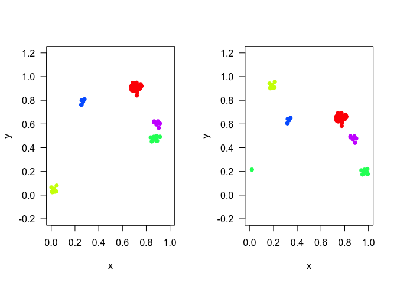

<!-- README.md is generated from README.Rmd. Please edit that file -->

# sRealmTools

<!-- badges: start -->

[](https://CRAN.R-project.org/package=sRealmTools)
[](https://github.com/sRealmWG/sRealmTools/actions/workflows/R-CMD-check.yaml)
<!-- badges: end -->

The goal of sRealmTools is to offer simulation tools, in time, on top of
mobsim spatial simulations. These functions let you make the classic
mobsim individuals move and die.

## Installation

You can install the development version of sRealmTools from
[GitHub](https://github.com/) with:

``` r
# install.packages("renv")
renv::install("sRealmWG/sRealmTools@dev")
```

## Example

This is a basic example which shows you how to solve a common problem:

``` r
library(sRealmTools)
simdat <- mobsim::sim_thomas_community(s_pool = 5L,
                                       n_sim = 100L,
                                       mother_points = 1L)
simdatJ <- jitter_species(simdat, sd = 0.05, drift = 0.05)
cat("Just one time step")
#> Just one time step
par(mfrow = c(1L, 2L))
plot(simdat)
plot(simdatJ)
```

 And now
several steps with species movement in between each step:

<figure>

<figcaption aria-hidden="true">30 steps of Community</figcaption>
</figure>
